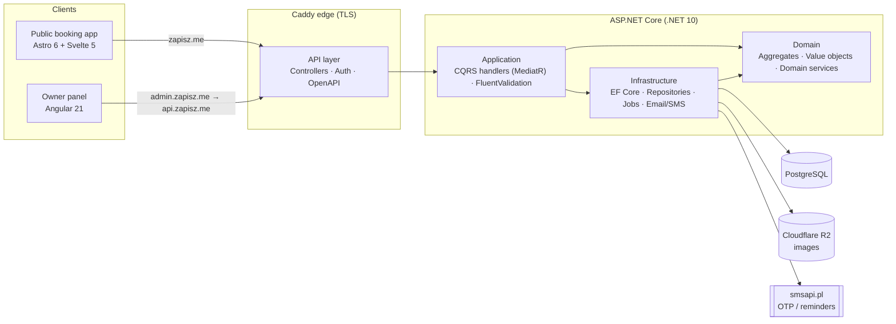

# zapisz.me — Booking SaaS for beauty salons

> A production, multi-tenant booking platform I designed and built end-to-end:
> a public online-booking experience for clients and a full management panel for
> salon owners. This repository is a **curated case study** — architecture,
> engineering decisions and representative code — not a dump of the private
> monorepo.

  
  
  
  
  

---

## Try it live

| What | Link | Notes |
|---|---|---|
| 🗓️ **Owner panel** — interactive demo | **[admin.zapisz.me/login?demo=1](https://admin.zapisz.me/login?demo=1)** | One click spins up an isolated, pre-seeded demo salon. No signup, no password. |
| 📅 **Client booking** — customer view | **[zapisz.me/demo-kalendarz](https://zapisz.me/demo-kalendarz)** | The real booking flow on sample data. Creates no real reservations. |
| 🌐 **Product site** | **[zapisz.me](https://zapisz.me)** | Landing page. |

> The owner-panel demo (`?demo=1`) provisions a **fresh, fully-isolated tenant per
> visitor**, seeds it with realistic salon data (services, clients, appointments
> around "today"), signs the guest in passwordless, and hard-deletes the tenant
> after a TTL. See [Demo mode](code-highlights/03-demo-mode.md) for how that works.

---

## What it is

A SaaS that lets a beauty salon take bookings online and run its day-to-day
operations. Two distinct product surfaces sit on one backend:

- **Public booking app** (Astro + Svelte) — a slug-scoped, anonymous flow where a
  client picks a service, sees real availability, holds a slot and confirms via
  a one-time code (OTP). Built to resist slot-squatting and SMS-cost abuse.
- **Staff/owner panel** (Angular) — calendar, appointments, services, clients,
  employees, working hours, SMS templates, promo codes, and subscription/billing.

Everything is **multi-tenant**: every salon's data is isolated at the database
layer with defence in depth (see below).

---

## Architecture at a glance

The backend follows **Clean Architecture** with a strict dependency direction
(API → Application → Domain; Infrastructure plugs in at the edges). Every feature
is a **CQRS** command or query record + handler, wired through MediatR with a
validation pipeline. OpenAPI clients for both frontends are **generated** from the
built API assembly (NSwag), so a contract change that isn't rebuilt fails loudly,
not silently.

Deeper write-up with diagrams: **[docs/architecture.md](docs/architecture.md)**.

---

## Engineering highlights

Four representative slices, each with real code and the reasoning behind it:

| # | Highlight | Why it's interesting |
|---|---|---|
| 01 | **[Multi-tenancy done in depth](code-highlights/01-multitenancy.md)** | Read isolation via EF global query filters **and** a write-side guard that throws on any cross-tenant save. Two independent layers, not one. |
| 02 | **[Booking domain & anti-abuse](code-highlights/02-booking-domain.md)** | Slot hold-leases with TTLs, per-IP hold caps, subscription gating in the write path, availability math. Designed against a hostile anonymous user. |
| 03 | **[Passwordless demo mode](code-highlights/03-demo-mode.md)** | Per-visitor ephemeral tenant, seeded data, auto-cleanup — a product feature that turns "let me show you" into a single link. |
| 04 | **[Modern frontend patterns](code-highlights/04-frontend.md)** | Angular **signal forms**, and a public booking flow where the demo and the real calendar share one component, differing only in data source. |

---

## Multi-tenancy, briefly

Every tenant-scoped entity implements `ITenantEntity`. Isolation is enforced twice:

1. **Read** — `ApplicationDbContext.OnModelCreating` installs a `HasQueryFilter`
   on every tenant entity, so queries physically cannot see another tenant's rows.
2. **Write** — `SaveChangesAsync` walks the change tracker and throws
   `TenantViolation` if any added/modified/**deleted** row carries a foreign
   `TenantId`.

The deliberate exceptions (platform-global entities like promo codes and support
impersonation logs) are documented inline at the point they're bypassed — not
hidden. Full code: [highlight 01](code-highlights/01-multitenancy.md).

---

## Testing philosophy

- **Integration tests run against real PostgreSQL** (Testcontainers), never
  InMemory — after a past incident where mocked tests passed but a real migration
  broke production. The database is a fresh container per fixture.
- Domain invariants and application handlers are unit-tested; every tenant-scoped
  handler has at least a happy-path **and** a cross-tenant `TenantViolation` test.
- Frontends test with Vitest (Angular) and Vitest + component tests (Svelte
  booking flow: OTP, wizard, booking-pause, reschedule, returning-customer paths).

---

## Tech stack

| Layer | Tech |
|---|---|
| **Backend** | .NET 10 · C# · Clean Architecture · CQRS (MediatR) · EF Core · PostgreSQL · FluentValidation · ASP.NET Identity · Serilog |
| **Owner panel** | Angular 21 · Signals & **signal forms** · PrimeNG 21 · Tailwind 4 · Vitest |
| **Booking app** | Astro 6 · Svelte 5 (runes) · Tailwind 4 · Vitest |
| **Infra / ops** | Docker · Caddy (TLS edge) · Cloudflare R2 (images) · Testcontainers · smsapi.pl (SMS/OTP) · `age`-encrypted env |

---

## What I owned

I built this solo, across the whole stack: domain modelling and the .NET backend,
the Angular management panel, the Astro/Svelte public booking app, the database
schema and migrations, the CI/testing setup, and the production deployment
(Docker + Caddy on a VPS, image storage on Cloudflare R2, transactional SMS via
smsapi.pl).

---

## Screenshots

Screenshots and short clips of the panel and booking flow live in
[`docs/screenshots/`](docs/screenshots/). For the real thing, the
[live demo links](#try-it-live) above are one click away.

---

Source snippets in this repository are excerpts from a private production
codebase, shared for evaluation. They are illustrative and not licensed for
reuse.
