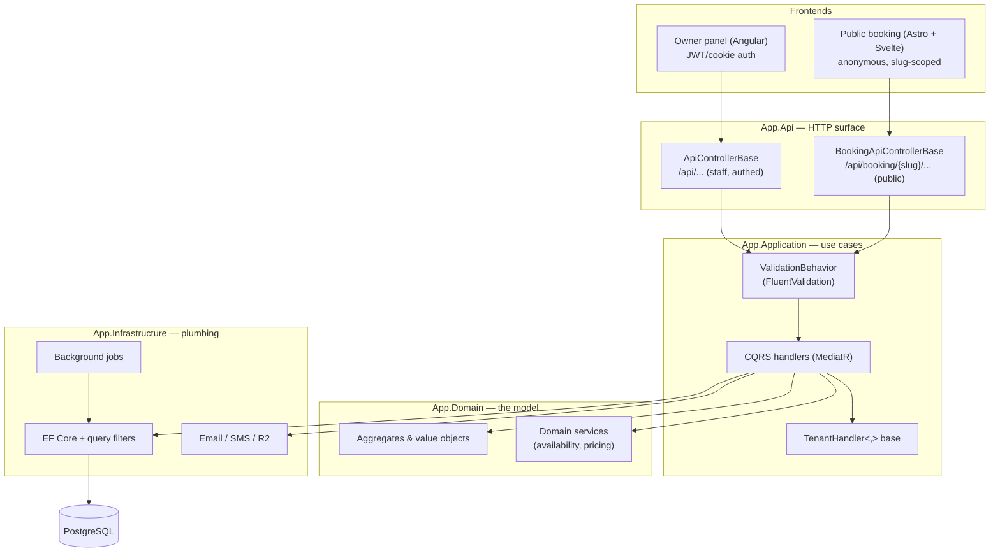
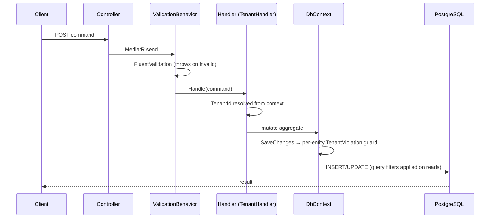

# Architecture

A deeper look at how zapisz.me is put together and why. This complements the
[README](../README.md); the four [code highlights](../code-highlights/) show the
same ideas at the source level.

## Bird's-eye view

Two frontends, one backend, one database. The backend is a single ASP.NET Core
(.NET 10) application arranged in Clean Architecture layers.

**Dependency rule:** Domain depends on nothing. Application depends on Domain.
Infrastructure implements Application's interfaces. The API composes them. This
keeps business rules testable without a database or a web server.

## Two API surfaces

| | Staff panel | Public booking |
|---|---|---|
| Base controller | `ApiControllerBase` | `BookingApiControllerBase` |
| Auth | ASP.NET Identity (cookie/JWT) | Anonymous |
| Route | `/api/...` | `/api/booking/{slug}/...` |
| Tenant resolution | from the authenticated employee | from the salon **slug** in the route |

Both ultimately run through the same tenant-scoped handlers, so the isolation
guarantees hold regardless of which surface the request came in on.

## Request lifecycle (a write)

## Multi-tenancy: defence in depth

The one rule that matters most in a multi-tenant SaaS is *never leak another
tenant's data*. zapisz.me enforces it in two independent places so a mistake in
one layer is caught by the other:

- **Read isolation** — a global `HasQueryFilter` per tenant entity. Forgetting a
  manual `Where(x => x.TenantId == ...)` can't leak data, because the filter is
  always on.
- **Write isolation** — `SaveChangesAsync` inspects every changed `ITenantEntity`
  and throws `TenantViolation` on a foreign `TenantId`, covering
  added/modified **and** hard-deleted rows.

Deliberate cross-tenant paths (platform-global promo codes, support-mode
impersonation, background SMS resolution) use `IgnoreQueryFilters` with an
explicit tenant `Where`, and each is commented at the call site explaining why the
global rule is being bypassed. See
[highlight 01](../code-highlights/01-multitenancy.md).

## Booking: designed against abuse

The public booking flow is anonymous and SMS costs real money, so it's built
defensively:

- **Hold leases** — picking a slot creates a short-lived hold (`HoldTtl = 60s`)
  before OTP; the OTP entry window is a separate lease (`OtpLeaseTtl = 3min`).
  This stops slot-squatting without permanently locking slots.
- **Anti-abuse layers** — auto-cancel of a session's previous pending holds, plus
  a hard per-IP cap on concurrent holds to defeat session-id rotation.
- **Subscription & pause gates in the write path** — not just the read path — so
  a crafted client can't call the hold endpoint directly to force a booking (and
  drain OTP SMS) on an inactive or paused salon.
- **Timezone-correct "today"** — past-date bookings are blocked in domain code
  using the tenant's `TimeZoneId`, not by the database.

See [highlight 02](../code-highlights/02-booking-domain.md).

## Background jobs

Long-running `BackgroundService`s, each taking a fresh DI scope per cycle:

- **Appointment reminders** — 24h and 2h windows.
- **Appointment status lifecycle** — time-based status transitions; abandoned
  holds with an expired lease are cleaned up.
- **Unconfirmed-account cleanup** — removes stale registrations after a TTL.
- **Demo-tenant cleanup** — hard-deletes ephemeral demo tenants past their TTL
  (a deliberate exception to the app's soft-delete rule).

## Deployment

Dockerized and served behind a Caddy edge that terminates TLS and routes by
host: `zapisz.me`/`www` → booking app, `admin.zapisz.me` → Angular panel,
`api.zapisz.me` → backend. Images live in Cloudflare R2; transactional SMS goes
through smsapi.pl. Production secrets are `age`-encrypted and never committed.
