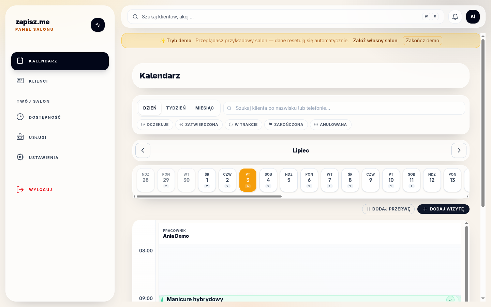
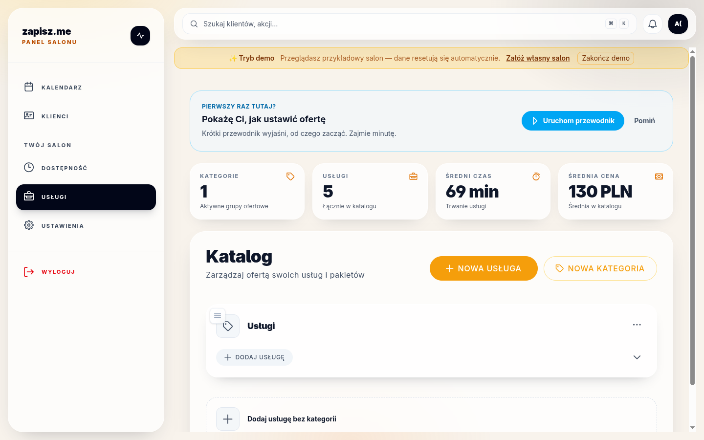
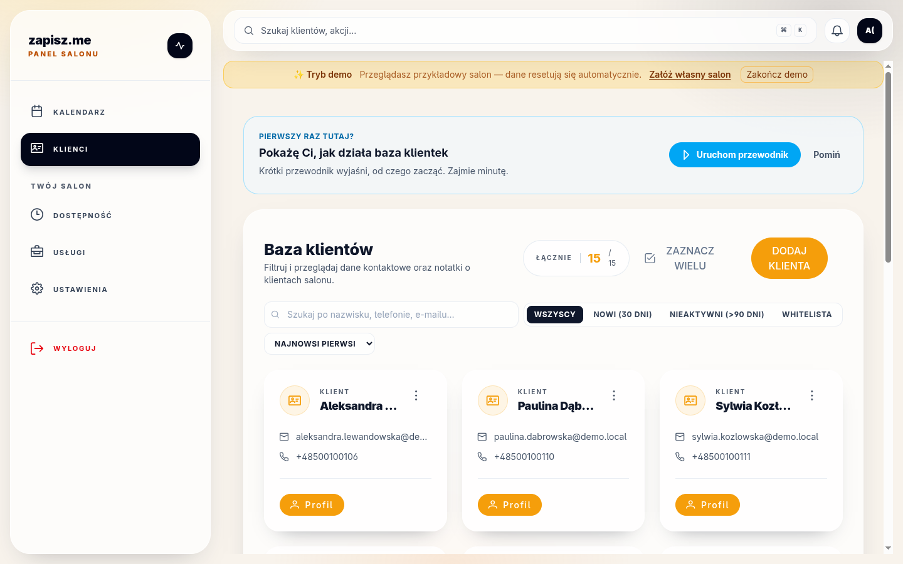
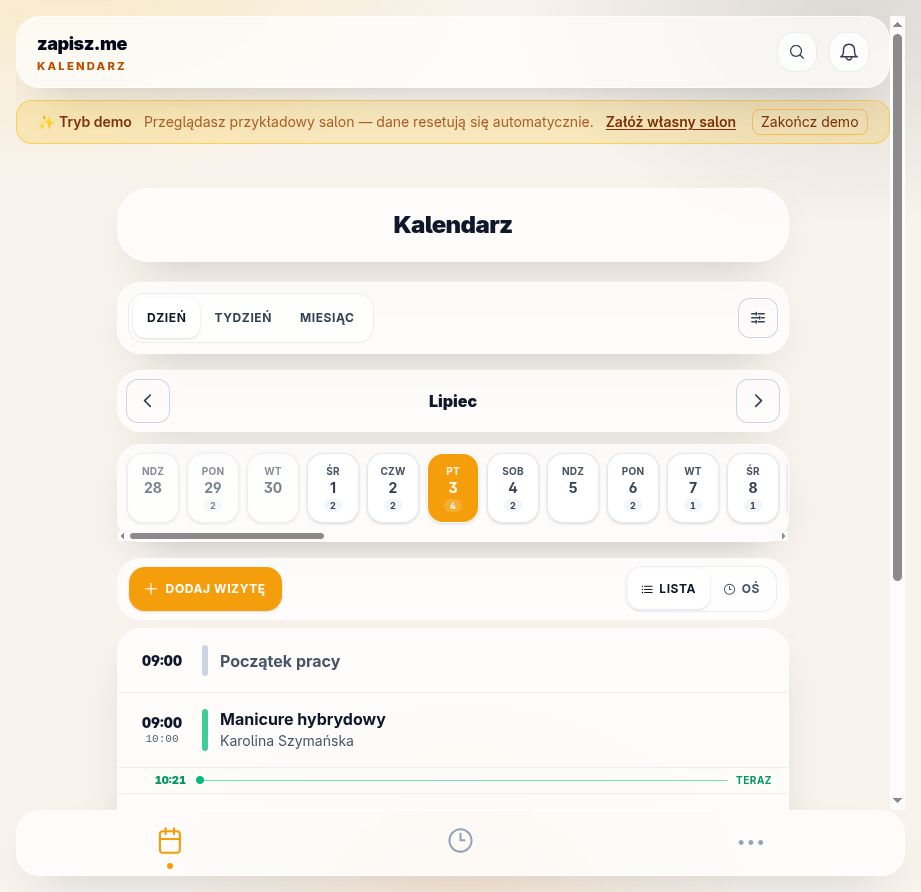
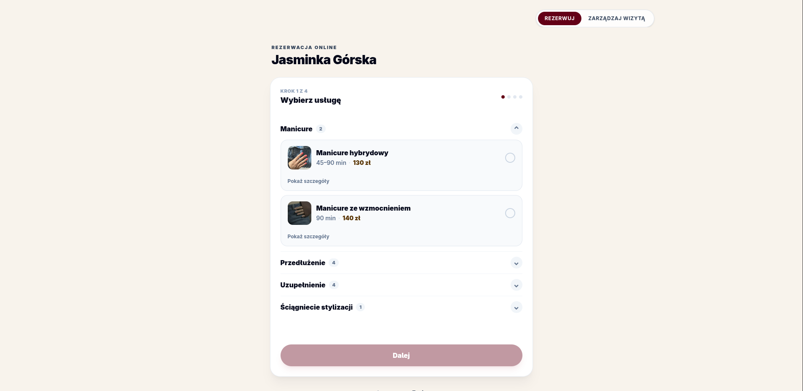
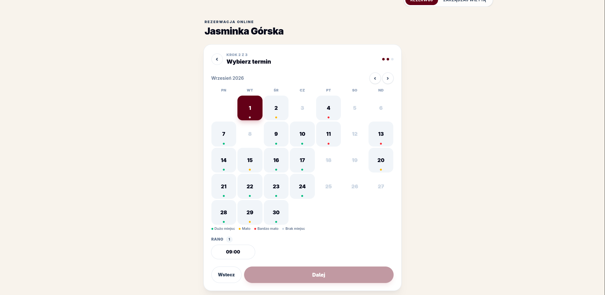
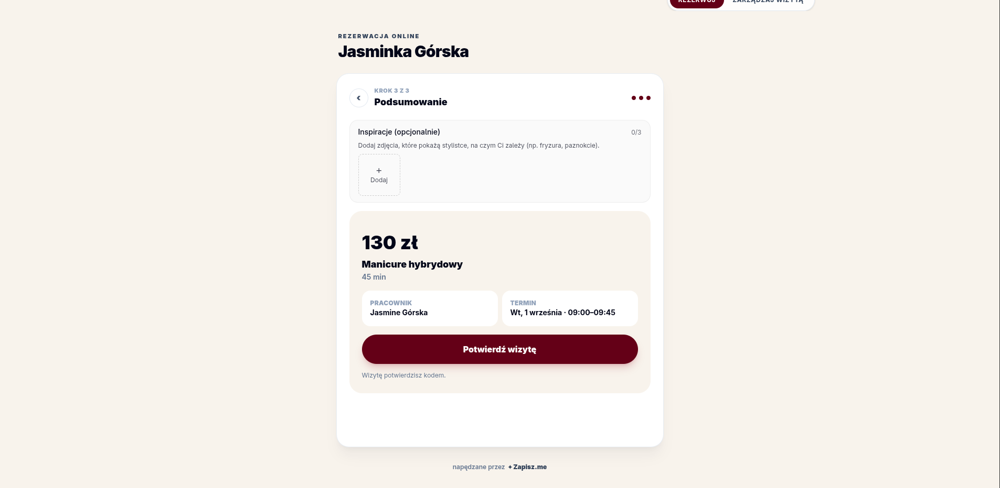
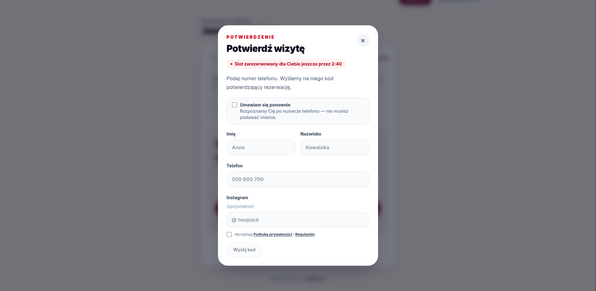

# Screenshots

Visuals used in the main [README](../../README.md). Every shot is from the **live
demo** — the owner panel from a per-visitor demo tenant
([admin.zapisz.me/login?demo=1](https://admin.zapisz.me/login?demo=1)), the
booking flow from the client-facing calendar.

## Owner panel (Angular)

**Calendar — day view with the "now" marker**

**Services — catalogue with at-a-glance stats**

**Clients — searchable customer base**

**Mobile — the same calendar, responsive**

## Client booking flow (Astro + Svelte)

**1. Pick a service** (with photos & price ranges)

**2. Choose date & time** (availability heat-map)

**3. Summary** (optional inspiration photos)

**4. Confirm via OTP** (slot held while you type)

